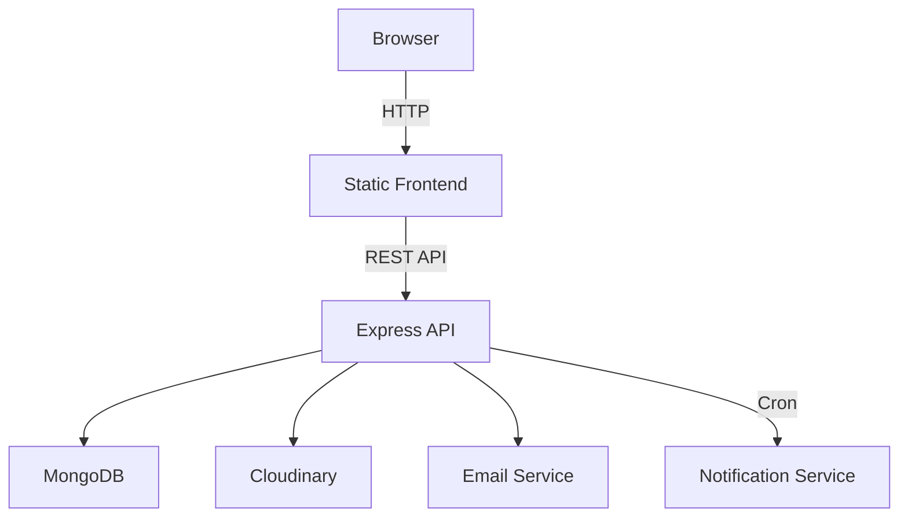

# Civic Resolve

A civic issue reporting and tracking web application with separate citizen and administrator interfaces.

## Overview

Civic Resolve is a full-stack web project for managing civic complaints. Citizens submit reports with media and location details, and administrators manage those reports through status updates, departmental assignment, and resolution tracking.

The backend is built with Node.js, Express, and MongoDB. The frontend uses static HTML, CSS, and JavaScript pages that interact with the REST API through a shared API client.

## Features

### Citizen features
- Register and login with email and password.
- Submit complaints with photo upload, optional voice recording, category, and geolocation.
- View personal complaint history and current status.
- Receive notifications for report status changes and reminders.
- Browse local service pages for police, hospital, and EV station information.

### Administrator features
- Access protected admin dashboard pages.
- View all reports and complaint metadata.
- Update report status and assign reports to departments or officials.
- Resolve reports with completion evidence.
- Fetch analytics and dashboard summary data.

### Platform features
- JWT authentication with access and refresh tokens.
- Role-based access control for citizen, department_admin, and super_admin.
- File upload pipeline with temporary local storage and Cloudinary media upload.
- Background job that sends reminders for overdue pending reports.
- Audit history tracking for report status changes.

## Tech Stack

| Frontend | Backend | Database | Authentication | Storage | Automation | Other |
|---|---|---|---|---|---|---|
| HTML | Node.js | MongoDB | JWT | Cloudinary | node-cron | Express |
| CSS | Express | Mongoose | bcrypt | multer |  | Nodemailer |
| JavaScript |  |  | refresh tokens |  |  | cookie-parser |

## Architecture Overview

The app separates user-facing static pages from backend API logic. The frontend sends requests to `/api/v1/*` endpoints. The backend handles authentication, report CRUD, media upload, notifications, and analytics. A scheduled background task checks pending reports and sends reminders.

## Engineering Highlights

- JWT authentication with access token validation and refresh token issuance.
- Role-based authorization via middleware for regular users, department admins, and super admins.
- Multipart file upload flow using `multer` and Cloudinary integration.
- Scheduled background job for overdue report reminders.
- Notification collection and report history tracking in MongoDB.
- Modular backend architecture with separate controllers, routes, middlewares, and utils.

## Project Workflow

1. User registers or logs in.
2. Citizen submits a complaint with media and location.
3. The backend stores the report and creates a history entry.
4. Admins review reports from the dashboard.
5. Admins assign reports, update status, and resolve issues.
6. Background job sends reminders for overdue pending reports.
7. Citizens view updated statuses and notifications.

## Folder Structure

- `frontend/` – static HTML, CSS, and JavaScript pages.
- `backend/` – Node.js/Express application and API.
- `backend/src/controllers/` – request handlers.
- `backend/src/models/` – Mongoose schemas.
- `backend/src/routes/` – API route definitions.
- `backend/src/middlewares/` – auth, file upload, and error handling.
- `backend/src/utils/` – Cloudinary, email, analytics, notifications.

## Getting Started

1. Open `backend/`.
2. Run `npm install`.
3. Create a `.env` file with database, JWT, Cloudinary, email, and CORS values.
4. Run `npm run dev`.
5. Open frontend HTML files in a browser or static server.

## License

No license specified.
